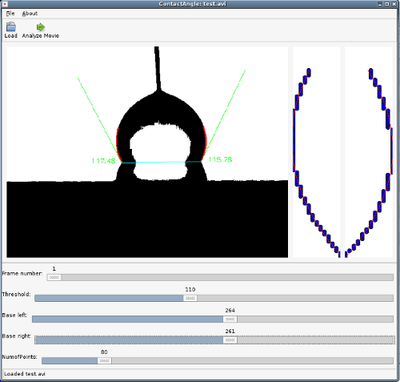

This page is about ContactAngle, a program to extract liquid contact
angles from images or videos of liquid droplets on a surface.

About
=====

The program is free and open source under a BSD license and will work
on various flavours of BSD, Linux and Windows (and possibly MacOS
X). It uses the [OpenCV](http://opencv.org/) computer vision library
for image processing and the [wxWidgets](http://www.wxwidgets.org)
toolkit for the user interface. 

It was originally created to optimise layer structures for digital
microfluidic (DMF) devices for work done at the [EMSG research
group](http://www.sircams.ed.ac.uk/emsg/) at the University of
Edinburgh, Scotland, UK. The reason for writing it was that we had no
access to a commercial program that would reliably and quickly extract
contact angles from videos with hundreds of frames.

Use the software at your own risk, I will take no responsibility or
liability if something breaks or goes wrong.

The author is Daniel Winters <daniel@tydirium.org>.

Downloads
=========

The homepage for the program with links to downloads is
[here](http://www.tydirium.org/cgi-bin/fossil/ContactAngle).

Usage
=====

For a description of how to use it, see [usage](./docs/Usage.md).

Building from source
====================

see [building from source](./docs/HowToBuild.md).

Known problems and caveats
==========================

It may not be as precise as some commercial programs (but it does the
job).

If you encounter bugs or would like a new feature not implemented yet,
please raise a ticket by clicking on the link on the navigation bar.
